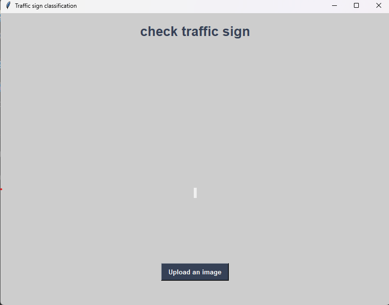

# Trafic Sign Recognition CNN and Keras 
 
A traffic sign classification using Deep Learning. The final model reach : 
 loss: 0.0666 - accuracy: 0.9818
We create GUI using Tkinter : 

!img](.\screenShot\Screenshot 2023-04-26 213902.png)

